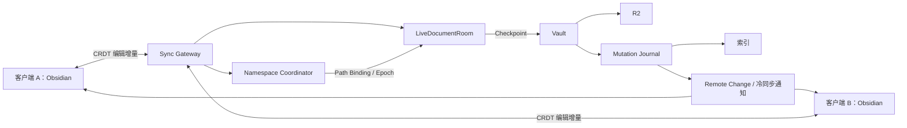

# Markdown 热同步方案

状态：待评审，尚未实现。  
日期：2026-09-28。  
范围：Mineral Obsidian Sync 插件、Sync Gateway、Vault、文档热会话 Durable Object、Namespace Coordinator，以及共享协议 `packages/sync-core`。

---

## 1. 目标与结论

Mineral 当前已经具备基于 R2 的冷同步能力。热同步是在此基础上增加的按文件实时协作层，不替代 R2，也不改变冷同步作为最终兜底路径的地位。

目标行为：

- 客户端 A 编辑 `path.md` 时，客户端 B 如果也打开同一个文档，可以近乎实时看到编辑。
- 双端同时编辑时，不通过整文件互相覆盖，而通过 CRDT 等可合并编辑模型同步。
- 客户端仍然保存真实本地 Markdown 文件。
- 服务端持久化已经接收的热编辑，并负责定期和最终保存到 R2。
- R2 继续保存正式、已提交的 Markdown 文件版本。
- R2 保存允许防抖，但不能因持续输入、客户端关闭、断网或被系统杀掉而无限延期。
- 热同步期间，同一路径的冷同步让路。
- 热会话完成 checkpoint、基线交接和 ownership 释放后，冷同步重新接管。
- 未配置 Gateway 的客户端保持现有 R2 冷同步能力。
- 热同步导致的本地文件变化不得再次被登记成普通冷上传。
- 新建、删除、重命名不是正文 CRDT 操作，而是独立的 namespace operation。

核心结论：

> **热同步期间，由服务器承担最终保存 R2 的责任，而不是指定某一台客户端作为“最终上传者”。**

客户端断网、关闭、Android 被系统杀掉，都不能让已经被服务器确认接收的编辑失去后续保存责任。

另一个核心结论：

> **热文档身份与文件路径必须分离。**

正文会话使用稳定的 `DocumentId + Epoch` 标识；路径只是当前的 namespace binding。

```text
DocumentId
    ↓
LiveDocumentRoom
    ↓
CRDT / revisions / checkpoints

canonicalPath
    ↓
Path Binding
    ↓
DocumentId
```

重命名不会把文档本身变成另一个文档，只会改变 Path Binding。

本方案描述目标架构和协议语义，不表示当前实现已经具备这些能力。

---

## 2. 架构与职责



| 组件 | 职责 |
| --- | --- |
| Obsidian 插件 | 捕获用户编辑、应用远端编辑、保存本地文件、持久化未确认操作、管理热冷交接、提交 namespace intent、显示冲突 |
| Sync Gateway | 鉴权、连接管理、协议版本协商、DocumentId / Namespace 请求路由 |
| Namespace Coordinator | 管理知识库内 Path Binding、Create/Delete/Rename、Document Epoch、按路径 ownership |
| LiveDocumentRoom | 合并编辑、持久化会话状态和待提交操作、发出接收确认、广播编辑、调度 checkpoint 和恢复 |
| Vault | 验证提交条件、写入 R2、写 tombstone、记录 Mutation、驱动现有消费者 |
| R2 | 保存冷同步、MCP、索引读取所使用的正式 Markdown checkpoint 和逻辑删除 tombstone |
| Mutation Journal | 记录 durable mutation fact，驱动索引和远端变更消费者 |
| RemoteChangeHub | 负责“远端可能发生变化”的 generation 唤醒，不承担文档实时版本职责 |

### 2.1 文档身份

热文档不能永久以 path 作为身份。

定义：

```text
KnowledgeBaseId
DocumentId
Epoch
CanonicalPath
```

其中：

- `DocumentId`：一个逻辑文档的稳定身份。
- `Epoch`：该文档当前 incarnation 的版本栅栏。
- `CanonicalPath`：当前 namespace 中绑定到文档的路径。
- `KnowledgeBaseId`：沿用 endpoint / bucket / prefix 的隔离规则派生。

Path Binding：

```text
canonicalPath → {
  documentId,
  epoch,
  state
}
```

状态至少包括：

```text
active
quiescing
deleted
conflicted
```

重命名后可以保持同一个 `DocumentId`，但必须 bump `Epoch`。

### 2.2 内容事实的边界

R2 继续作为**已提交内容**的事实源。

尚未提交到 R2 的热编辑，由 LiveDocumentRoom 的持久化状态承担恢复责任。

因此：

```text
Hot Durable State
= 已被服务端接收、但可能尚未写入 R2 的内容事实

R2
= 已完成 checkpoint 的正式内容事实
```

MCP 精确读取与索引第一版仍读取 R2，所以它们可以暂时落后于热会话。

不能：

- 把“收到一条热编辑消息”解释为“R2 已更新”。
- 让索引直接按热编辑消息里的正文发布。
- 把 RemoteChangeHub generation 当成文档 revision。
- 把 R2 ETag 当成 CRDT revision。

---

## 3. 编辑流与确认语义

正常热编辑流程：

1. A 在编辑器中输入。
2. A 立即更新本机编辑器。
3. 插件先把 operation 写入 device-local persistent outbox。
4. 插件通过 WebSocket 发送 operation。
5. LiveDocumentRoom 校验 `DocumentId + Epoch + operationId`。
6. LiveDocumentRoom 持久化 operation 及恢复所需状态。
7. 服务端发送“已接收”确认。
8. 服务端广播给 B。
9. B 应用远端 operation，并通过受控入口保存本地 Markdown。
10. 服务端按保存策略生成某一明确 revision 的 Markdown snapshot。
11. Vault 条件写入 R2。
12. Mutation Journal 记录对应 mutation。
13. 服务端发送“已保存到 R2”的 checkpoint receipt。

必须区分两个确认：

| 确认 | 含义 |
| --- | --- |
| 已接收 | operation 已在服务端持久化，发送客户端离线后服务器仍承担后续 checkpoint 责任 |
| 已保存到 R2 | 某个明确 document revision 已完成 R2 写入，并获得对应 durable commit identity |

以下都不能替代“已保存到 R2”：

- WebSocket 已连接。
- 消息已经发送。
- 另一台客户端已经显示。
- 服务端已经广播。
- R2 写请求已经发出但响应未知。

### 3.1 Operation identity

每个编辑 operation 必须有可去重身份，例如：

```text
clientId
clientOperationId
documentId
epoch
```

重传不能重复应用。

旧 epoch 的 operation 必须拒绝：

```text
documentId = D1
message epoch = 7
current epoch = 8
→ REJECT_STALE_EPOCH
```

### 3.2 本地可靠性边界

本地 persistent outbox 只能保护“已经成功写入本地持久化队列”的 operation。

设备在本地持久化完成前突然断电的最后输入，仍然存在损失窗口。

不能宣称“用户按下键盘的每个字符都已经 durable”。

---

## 4. R2 保存策略

第一版建议值：

| 触发条件 | 动作 |
| --- | --- |
| 停止编辑 2 秒 | 保存当前稳定 revision |
| 连续编辑累计 10 秒仍未 checkpoint | 保存一个中间 revision |
| 客户端正常关闭该文档 | 请求尽快 checkpoint，至少覆盖该客户端离开前已被服务端接收的 operation |
| 最后一个客户端离开 | 立即执行最终 checkpoint |
| 客户端异常断开 | 继续处理服务端已持久化但尚未 checkpoint 的内容 |
| R2 暂时失败 | 保留 target snapshot 和任务，退避重试，并显示 pending save |

10 秒是正常情况下的**最大触发间隔目标**，不是 R2 故障时的完成 SLA。

单客户端打开文件也可以进入 hot session，不需要等待第二台设备加入。

### 4.1 保存过程中的并发

同一个 `DocumentId` 的 R2 checkpoint 串行执行。

每次 checkpoint 固定：

```text
targetDocumentRevision
targetContentHash
targetMarkdownSnapshot
expectedRemoteState
commitId
```

网络请求期间的新编辑继续进入更高 revision。

例如：

```text
开始保存 V42
↓
期间产生 V43 / V44 / V45
↓
V42 保存成功
```

只允许：

```text
savedRevision = 42
pendingRevision = 45
```

不能把 V45 一并标记为 saved。

### 4.2 持久化调度

保存调度不得依赖：

- 客户端仍在线。
- WebSocket 仍存在。
- Worker 内存 timer。
- 某一台客户端最终上传。

应使用 Durable Object 的 durable alarm / 持久化任务状态。

持久化至少包含：

```text
latestAcceptedRevision
latestCheckpointedRevision
pendingCheckpointTarget
checkpointContentHash
commitId
retryState
nextAttemptAt
```

Alarm 重复执行必须幂等。

长期失败必须主动重新安排，不能只依赖平台有限次数的自动重试。

---

## 5. 关闭时的保存保证

### 5.1 正常关闭文件

理想流程：

```text
收集最后的编辑
→ 写入本地 persistent outbox
→ 发出待发送 operation
→ 等待服务端确认已持久化
→ 请求 checkpoint
→ 等待覆盖本客户端最后 accepted revision 的 checkpoint receipt
→ 完成该客户端的热会话退出
```

A 退出时 B 可以继续输入。

A 等待的是：

```text
checkpointRevision >= A.lastAcceptedRevision
```

而不是要求：

```text
checkpointRevision == room.latestRevision
```

否则 B 持续输入会让 A 永远无法退出。

### 5.2 多窗格

同一客户端多个窗格打开同一文件时，按 `DocumentId` 或 canonical file identity 统计本客户端引用。

关闭一个窗格：

```text
clientDocumentRefCount > 0
```

不等于客户端离开文档。

### 5.3 平台限制

Obsidian Windows / Android 是否允许 UI 关闭动作等待完整握手，需要真实设备验证。

如果 UI 已关闭而握手未完成：

- 本地 pending state 仍须持久化。
- 不能显示“已经全部保存”。
- 下次启动必须恢复交接。

### 5.4 异常退出

如果客户端崩溃：

```text
operation 已获 server durable ack
→ server 继续负责 checkpoint

operation 仅存在本地 outbox
→ 下次启动重新协商后补送

operation 尚未进入本地 outbox
→ 不保证恢复
```

关闭事件只是提前触发 checkpoint 的机会。

可靠性来自全过程持久化，不来自 `beforeunload` 一类事件。

---

## 6. 热冷交接

状态机：

```text
COLD
  ↓
ACQUIRING
  ↓
HOT_ACTIVE
  ├─→ DISCONNECTED_PENDING
  ├─→ QUIESCING_FOR_RENAME
  ├─→ QUIESCING_FOR_DELETE
  ├─→ EXTERNAL_CONFLICT
  └─→ HANDOFF_TO_COLD
            ↓
           COLD
```

### 6.1 接入热会话

接入步骤：

1. 对 path 建立 acquisition intent。
2. 冷 scheduler 从该 path 开始禁止新的 mutation execution。
3. 已经进入 executor 的旧冷操作允许按既有安全边界结束。
4. 读取本地当前状态。
5. 读取 R2 effective remote state。
6. 查询 Namespace Coordinator 当前 binding。
7. 如果已经有 active hot session，验证能否 join。
8. 如果 local / remote / hot durable state 存在差异，先协调或进入 conflict。
9. 服务端确认 `DocumentId + Epoch + PathBinding`。
10. 插件持久化 hot ownership。
11. 进入 `HOT_ACTIVE`。

禁止：

```text
发现已有 hot room
→ 把本地全文当成一次 CRDT insert
```

也禁止：

```text
发现 remote 不同
→ 直接覆盖 local
```

### 6.2 热会话期间

热文件仍然保存真实本地 Markdown。

但 cold scheduler 对该 path：

```text
upload
download
delete-local
delete-remote
conflict resolution
baseline GC
```

都不得自行执行。

其他文件继续正常冷同步。

热文件不能简单加入普通 `ignoredPaths`。

必须有单独的 per-path coordination state。

### 6.3 三重防线

#### 事件入口

热同步自身产生的本地写入：

```text
remote hot op
→ local controlled write
```

不得重新登记成：

```text
cold local modification
```

#### Planner

full reconciliation 仍然可以观察 hot path，但必须输出：

```text
deferred-by-hot-ownership
```

或等价事实。

不能把 hot path 当 missing。

不能据此产生 deletion inference 或 baseline GC。

#### Executor

执行旧 plan 前再次验证：

```text
path ownership token / epoch
```

如果 path 已被 hot session 接管：

```text
stale/deferred
```

不得执行旧 upload/download/delete。

---

## 7. Baseline 交接

热 session checkpoint receipt 至少需要表达：

```text
protocolVersion
documentId
epoch
documentRevision
contentHash
r2ETag
commitId
canonicalPath
```

最终 wire 字段在协议阶段冻结。

客户端只有在确认：

```text
local stable content hash
==
receipt content hash
```

并且：

```text
local corresponds to receipt.documentRevision
```

时，才允许建立 cold previous baseline。

例如：

```text
server receipt = V42
local editor already at V45
```

只能确认 V42。

不得：

```text
把 local V45
登记成
remote V42 / ETag X
```

V43-V45 仍然是 hot pending state。

只有以下全部完成：

```text
checkpoint confirmed
+
local stable version verified
+
previous baseline committed
+
merge base committed if needed
+
namespace ownership released
```

才恢复 cold mutation authority。

baseline commit 失败：

```text
stay HANDOFF_PENDING
```

不能因为 R2 已成功就猜测交接完成。

---

## 8. 避免编辑回声与重复冷上传

必须区分 mutation source：

```text
USER_EDIT
REMOTE_HOT_EDIT
HOT_LOCAL_MATERIALIZATION
COLD_DOWNLOAD
CONFLICT_RESOLUTION
EXTERNAL_LOCAL_WRITE
```

规则：

- `REMOTE_HOT_EDIT` 不能重新作为用户 CRDT 输入发送。
- `HOT_LOCAL_MATERIALIZATION` 不能登记成 cold upload。
- `COLD_DOWNLOAD` 不能误认为用户 hot edit。
- 外部编辑器 / 其他插件的写入不能因为 path 是 hot 就直接忽略。
- 外部修改要么进入 hot input，要么触发 coordination/conflict。

禁止依赖：

```text
“未来 500ms 忽略 modify”
```

这类时间窗口 suppression。

来源标记、ownership 和 baseline handoff 是三个不同概念：

```text
source marker
→ 防止回声

ownership
→ 防止 hot/cold 同时写

baseline handoff
→ 防止 hot 结束后 cold 重复上传
```

三者不能互相替代。

---

## 9. Namespace Operations

CRDT 只负责文档正文。

以下操作属于 namespace：

```text
CREATE
DELETE
RENAME
```

它们不是 Yjs text operation，也不进入正文 undo history。

### 9.1 核心不变量

1. `DocumentId` 与 path 分离。
2. Path Binding 的变化必须经过 durable coordination。
3. Create 必须证明目标 path 可创建。
4. Delete 不能被表示成“正文变为空字符串”。
5. Rename 同时协调 old path 和 new path。
6. Rename 后保持同一个 `DocumentId`，但 bump `Epoch`。
7. Delete 成功后旧 epoch 的 operation 不得复活文档。
8. 热删除继续使用现有 logical tombstone，不要求 unsafe physical R2 DELETE。
9. namespace operation 必须幂等。
10. namespace op 期间 cold scheduler 不得对相关 path 执行旧计划。
11. 外部 cold mutation 可以产生 conflict，但不得被 hot checkpoint 静默覆盖。
12. Namespace Coordinator 与 RemoteChangeHub 是不同职责。

---

## 10. Namespace Coordinator

Namespace Coordinator 是一个逻辑角色，用于管理知识库范围的 path namespace。

建议第一版采用 knowledge-base scoped coordinator，而不是一个 path 一个 coordinator。

原因：

```text
rename oldPath → newPath
```

需要同时验证：

```text
oldPath still bound to D1
newPath still available
```

并原子修改 coordinator 自己的 Path Binding 状态。

如果 old / new 分属两个独立 DO，则 rename 会立刻变成跨 DO 协调问题。

Namespace Coordinator 至少维护：

```text
PathBinding {
  canonicalPath
  documentId
  epoch
  state
  updatedAt
}
```

以及 namespace operation：

```text
NamespaceOperation {
  operationId
  type
  expectedState
  targetState
  phase
}
```

Coordinator 不保存 Markdown 正文。

LiveDocumentRoom 不承担全知识库 namespace registry。

---

## 11. 新建文件

### 11.1 Cold-only 客户端

没有 Gateway 或未申请 hot session：

```text
local create
→ existing cold planner
→ If-None-Match: *
→ R2
```

保持现有行为。

### 11.2 Hot create

如果创建后直接进入热会话：

```text
CREATE_INTENT
knowledgeBaseId
canonicalPath
expectedPathState = absent
operationId
```

Coordinator 验证：

```text
path 未绑定 active document
+
没有阻止创建的有效 namespace state
```

然后分配：

```text
DocumentId = D1
Epoch = E1
```

建立：

```text
path → D1@E1
```

再创建或激活 LiveDocumentRoom。

### 11.3 并发 create

A、B 同时创建 `a.md`：

```text
A CREATE expected absent
B CREATE expected absent
```

只能一个成功。

另一个收到：

```text
PATH_STATE_CHANGED
```

然后重新协调。

不得：

```text
创建两个独立 room
→ 最后靠 R2 last writer wins
```

---

## 12. 删除文件

删除不是：

```text
replace document content with ""
```

空文件和不存在文件是不同状态。

### 12.1 删除状态转换

热文档：

```text
HOT_ACTIVE
↓
DELETE_INTENT
↓
QUIESCING_FOR_DELETE
↓
checkpoint 已接收正文
↓
建立 logical tombstone
↓
Path Binding → deleted
↓
Epoch bump / incarnation retired
↓
广播 document-deleted
↓
客户端受控移入回收站
```

### 12.2 Delete Intent

至少包含：

```text
operationId
documentId
expectedEpoch
canonicalPath
expectedDocumentRevision
expectedRemoteState
```

### 12.3 删除中的并发编辑

一旦服务端正式接受 deletion transition：

```text
room = QUIESCING_FOR_DELETE
```

第一版不再接受新的普通正文 operation。

其他客户端收到：

```text
DOCUMENT_DELETE_PENDING
```

进入只读或 conflict handling 状态。

如果客户端还有未被服务端确认的本地 operation：

```text
delete-vs-local-unacked-edits
```

不得静默丢弃。

必须允许用户选择：

```text
Restore / Keep Local Content
Accept Delete
```

### 12.4 Tombstone

继续沿用 cold sync 的 logical tombstone。

例如：

```text
R2 object a.md ETag = AAA
```

删除产生：

```text
tombstone(
  path = a.md,
  deletedRemoteETag = AAA
)
```

物理 object A 可以继续存在。

effective remote state：

```text
object AAA + tombstone AAA
→ deleted

object BBB + tombstone AAA
→ BBB exists
```

因此旧 tombstone 不能隐藏后续重新创建的新版本。

### 12.5 防止自动复活

如果一个旧客户端或外部写入在 hot session 期间删除文件：

LiveDocumentRoom 下一次 checkpoint 不能自动：

```text
PUT old hot content
→ 复活文件
```

checkpoint 前必须验证：

```text
coordinator epoch
+
effective remote deletion state
+
expected object version
```

发现外部 delete：

```text
HOT_ACTIVE
→ EXTERNAL_CONFLICT
```

由用户决定：

```text
Restore Hot Content
Accept External Delete
```

---

## 13. 重命名文件

Rename 是同时涉及两个 path 的 namespace operation。

例如：

```text
notes/a.md
→
archive/a.md
```

语义：

```text
release oldPath
+
claim newPath
+
keep same DocumentId
+
bump Epoch
```

### 13.1 Rename Intent

至少包含：

```text
operationId
documentId
expectedEpoch
oldPath
newPath
expectedOldBinding
expectedNewPathState = absent
```

### 13.2 第一版 rename 流程

第一版不追求“输入完全不停顿的实时 rename”。

采用短暂 quiesce：

```text
HOT_ACTIVE(D1,E7,a.md)
↓
RENAME_INTENT(a.md → b.md)
↓
同时协调 oldPath / newPath
↓
QUIESCING_FOR_RENAME
↓
checkpoint 当前 accepted revision
↓
验证 old binding 仍是 D1@E7
↓
验证 newPath 仍 absent
↓
Vault 执行：
  PUT b.md
  tombstone a.md
↓
Coordinator 更新：
  a.md → deleted
  b.md → D1@E8
↓
LiveDocumentRoom bump epoch
↓
客户端重新 attach D1@E8
↓
HOT_ACTIVE(b.md)
```

R2 物理视图可能仍然：

```text
a.md object exists
b.md object exists
tombstone(a.md) exists
```

但 effective remote：

```text
a.md = deleted
b.md = exists
```

### 13.3 为什么 rename 要 bump Epoch

网络上可能还有旧包：

```text
EDIT
documentId = D1
epoch = 7
```

rename 后：

```text
documentId = D1
epoch = 8
```

旧 operation：

```text
epoch 7
```

必须拒绝。

否则迟到消息可能被应用到 rename 后的新 path incarnation。

### 13.4 目标 path 已存在

如果：

```text
a.md → b.md
```

但 `b.md` 已存在：

```text
RENAME_TARGET_EXISTS
```

禁止自动覆盖。

如果 b.md 是另一个 hot document：

```text
a.md → D1
b.md → D2
```

第一版直接进入 rename conflict。

不得尝试把两个 CRDT 文档自动合并成一个。

---

## 14. Namespace Operation 幂等与恢复

所有 namespace operation 必须带：

```text
operationId
```

重复提交同一 operationId：

```text
不得重复执行
```

操作需要持久化 phase，例如：

```text
REQUESTED
QUIESCING
CHECKPOINTED
R2_APPLIED
BINDING_UPDATED
ACKED
```

或等价模型。

崩溃恢复必须覆盖：

```text
checkpoint 已完成，但 rename 尚未写新 path
new object 已写，但 tombstone 尚未完成
R2 已完成，但 Path Binding 尚未更新
Path Binding 已更新，但客户端未收到回执
```

不能靠客户端重新发一遍然后无条件重复 mutation。

---

## 15. Namespace 与 R2 不是单事务

Coordinator state、LiveDocumentRoom state、R2、Mutation Journal 不构成一个跨存储 ACID transaction。

因此 create/delete/rename 必须设计为：

```text
durable state machine
+
idempotent steps
+
recovery verification
```

不能依赖：

```text
“这几步通常很快，所以不会中断”
```

每一步都要能在 Worker crash 后判断：

```text
已经完成
尚未完成
结果未知，需要验真
```

---

## 16. 无 Gateway 客户端与外部直写

如果 A、B 使用 hot sync，而 C 没有 Gateway，且直接持有 R2 凭据，则 C 可以绕过 Namespace Coordinator。

因此保证分两层。

### 16.1 新协议参与者

使用 Gateway 的客户端：

```text
cold write
hot write
create
delete
rename
```

都必须遵守 per-path coordination。

### 16.2 Legacy / external writer

旧客户端和外部程序仍可能直接：

```text
PUT
tombstone
recreate
```

系统不能承诺它们不会制造 conflict。

但必须保证：

- 条件写入阻止明显 stale overwrite。
- hot checkpoint 不静默覆盖外部变更。
- 外部 delete 不被 hot session 自动复活。
- 外部 recreate 不被旧 tombstone 自动隐藏。
- 冲突被保留并呈现，而不是 silently last-writer-wins。

---

## 17. Cold writer 与 Hot Session 协调

启用 Gateway 的 cold client 即使没有打开该文件，在准备 mutation 前也要遵守协调。

不能：

```text
GET /is-hot
→ false
→ 过 300ms 直接 PUT
```

因为这是 TOCTOU。

需要 server-issued path authority / lease / epoch token 或等价机制。

概念上：

```text
AcquireColdMutation(path, expectedState)
↓
server verifies no conflicting hot ownership
↓
returns mutation authority bound to epoch/state
↓
client performs safe mutation
↓
commit/release
```

精确协议在下一阶段冻结。

没有 Gateway 的 legacy client 无法被这种机制绝对隔离。

---

## 18. 条件 R2 checkpoint

更新已有 object：

```text
If-Match: expectedETag
```

创建：

```text
If-None-Match: *
```

如果 precondition 不满足：

```text
HOT_ACTIVE
→ EXTERNAL_CONFLICT
```

不得自动覆盖。

R2 timeout / response loss：

```text
不能直接当成“失败后重写”
```

必须通过 `commitId + expected result` 恢复核验。

ETag：

- 是 opaque token。
- 不是单调递增版本。
- 不是 CRDT revision。
- 不能作为整个文档历史 identity。

---

## 19. CRDT 模型

第一版建议采用 Yjs 一类成熟 CRDT。

CRDT 只解决：

```text
同一逻辑文档正文的并发编辑
```

CRDT 不解决：

```text
R2 cold overwrite
delete
rename
path collision
legacy client
tombstone
hot/cold ownership
```

### 19.1 持久化

不能每次 reconnect 都：

```text
从 Markdown 重新建立 Y.Doc
+
继续套旧 operation
```

必须持久化：

```text
documentId
epoch
CRDT state / snapshot
operation recovery state
latest revision
```

会话压缩后仍须保留可恢复状态。

### 19.2 初次加入

如果已有：

```text
R2 = A
local = B
room = C
```

不能把 B 全文作为 insert 灌进 room。

必须进入 acquisition conflict / reconciliation。

### 19.3 编辑器验证

真实设备必须验证：

- 中文 IME composition。
- 光标保持。
- selection。
- undo / redo。
- Android 输入。
- 多窗格。
- Obsidian 自动保存。
- 插件 API 产生 modify event 的具体行为。

---

## 20. R2 Checkpoint 与 Mutation Journal

每次 R2 checkpoint 成功后，复用现有 Mutation Journal。

逐条 CRDT operation 不进入索引。

```text
CRDT ops
→ LiveDocumentRoom durable state
→ Markdown checkpoint
→ Vault R2 write
→ Mutation Journal
→ index + RemoteChange
```

R2、DO、Journal 不能组成跨存储事务。

必须覆盖以下恢复窗口：

| 中断位置 | 恢复要求 |
| --- | --- |
| R2 写入前 | 从 durable target snapshot 继续 |
| R2 已写，响应丢失 | 核验 commit 是否已经落地 |
| R2 已写，Journal 未记录 | 以同 commitId 补 Journal |
| Journal 已记录，client 未收到 receipt | 重发 receipt，不产生第二次 Mutation |
| receipt 已发，client 未持久化 baseline | 客户端通过恢复协议重新确认 |

### 20.1 Commit identity

服务端 checkpoint 使用独立：

```text
commitId
```

它不是 R2 ETag。

用于关联：

```text
target revision
R2 result
Journal record
checkpoint receipt
recovery
```

具体如何让 R2 object 可验证 commitId，需要协议阶段决定，例如 object metadata 或 durable commit record。

---

## 21. RemoteChangeHub 的角色

RemoteChangeHub generation 继续只表示：

> 远端 durable state 可能发生了变化。

它不能表示：

```text
CRDT revision
Document epoch
Path Binding version
Checkpoint revision
```

热 checkpoint 成功后：

```text
Mutation Journal
→ RemoteChangeHub
```

用于唤醒未参加该 hot session 的其他 cold client。

已经持有该文档 hot ownership 的客户端不应因为这条全局通知重新执行 cold mutation。

---

## 22. 热文件与全局 generation 游标

一个重要问题：

```text
remote generation G100
包含 path.md 的变化

客户端当前 hot-own path.md
```

客户端可以推进全局 generation，但不能因此忘掉这个 path 有未处理 cold fact。

必须单独记录：

```text
deferredRemoteFactsByPath
```

或等价 per-path pending coordination state。

所以：

```text
global generation reconciled
```

不等于：

```text
所有 path 都已经应用 cold result
```

hot path 可以：

```text
observe
defer
later reconcile during handoff
```

但不能被 generation cursor 吞掉。

---

## 23. Gateway 缺失与断线降级

| 状态 | 行为 |
| --- | --- |
| 从未配置 Gateway | 完整使用现有 R2 cold sync |
| 尚未申请 hot ownership，Gateway 不可达 | 可继续 cold sync |
| acquisition 请求已发送但结果未知 | 查询/恢复 ownership，不得猜测失败 |
| 已进入 hot session 后 WebSocket 断开 | 保留 ownership、epoch、outbox，优先恢复 hot session |
| Gateway setting 被关闭 | 新 path 不再进入 hot；已有 hot path 必须完成 handoff |
| 插件重启 | 从 persistent hot state 恢复，不能仅看内存 set |

已进入 hot session 后：

```text
WebSocket disconnected
```

不能立即：

```text
fall back to direct cold PUT
```

因为：

- server 可能仍保存 checkpoint。
- 其他 client 可能仍编辑。
- ownership 可能仍有效。

断线期间本地可以继续编辑，但 operation 必须进入 persistent outbox。

---

## 24. 外部修改

当 hot path 的本地文件被：

```text
其他插件
外部编辑器
filesystem 工具
```

修改时，不能因为 path 正在 HOT 就忽略。

需要比较：

```text
lastControlledMaterialization
currentDiskState
currentCRDTState
```

如果不是已知 hot local write，则解释为：

```text
EXTERNAL_LOCAL_EDIT
```

然后：

- 能安全转化为 hot input 时，进入 hot coordination。
- 无法证明差异来源时，进入 conflict。
- 不得悄悄覆盖外部内容。

第一版可以保守：

```text
external local modification while hot
→ pause hot document
→ conflict
```

后续再优化成 diff import。

---

## 25. 删除、重建与 Tombstone

Tombstone 是独立 namespace fact，不是正文内容。

热 session checkpoint 前必须考虑：

```text
current object ETag
current effective tombstone state
current coordinator epoch
```

只有验证一致时才允许 checkpoint。

### 25.1 Recreate

例如：

```text
A 被删除
tombstone targets ETag A

之后用户重新创建同路径 B
```

如果 B 是新的 object version：

```text
B ETag != A
```

旧 tombstone 不得隐藏 B。

namespace 层应产生新的 incarnation：

```text
new DocumentId
```

或根据明确 restore 语义决定是否复用旧 DocumentId。

第一版建议：

```text
普通 recreate after completed delete
→ new DocumentId
```

这样旧 room operation 不可能污染新文档。

---

## 26. Delete vs Modify Conflict

必须区分：

```text
local-modified-remote-deleted
local-deleted-remote-modified
```

它们不是普通文本 merge conflict。

### 26.1 Local modified, remote deleted

用户选择：

```text
Keep / Restore Local
Accept Delete
```

Keep Local：

```text
建立新的有效 remote incarnation
```

Accept Delete：

```text
安全丢弃本地修改
→ local trash
```

必须绑定 exact conflict identity。

### 26.2 Local deleted, remote modified

用户选择：

```text
Restore Remote
Accept Local Delete
```

Accept Local Delete：

```text
针对当前 exact remote version 建 tombstone
```

如果 remote 又变化，旧 intent stale。

---

## 27. Rename Conflict

需要至少识别：

```text
target-path-exists
source-binding-changed
source-deleted-externally
target-created-concurrently
old-epoch-message
```

第一版不做自动 rename conflict merge。

用户需要重新选择目标 path 或接受当前 namespace 状态。

---

## 28. Conflict Identity

所有 hot/cold/namespace conflict 都必须绑定实际观察到的版本身份。

概念上：

```text
ConflictId = hash(
  protocolVersion,
  knowledgeBaseId,
  documentId?,
  epoch?,
  canonicalPath(s),
  baseline identity,
  local identity,
  remote effective identity,
  namespace binding identity
)
```

用户打开 conflict UI 后，如果 world state 改变：

```text
old ResolutionIntent
→ stale
```

不能把旧决策应用到新版本。

---

## 29. Planner 与执行边界

现有原则继续保持：

```text
Planner = pure decision maker
Executor = mutation boundary
```

WebSocket callback 不允许直接：

```text
Vault.modify
R2 PUT
baseline commit
tombstone
rename
```

热系统也应有等价的明确执行入口。

例如：

```text
HotOperationPlanner
NamespaceCoordinator
CheckpointExecutor
LocalMaterializationExecutor
```

具体类名可以不同，但职责必须分离。

---

## 30. 本地持久化

插件至少需要持久化：

```text
HotSessionState
PendingOperationOutbox
LastServerAck
LastCheckpointReceipt
PathOwnershipState
PendingHandoff
NamespaceOperationState
```

不要依赖：

```text
Set<string> hotPaths
```

这种纯内存状态作为 correctness 前提。

插件重启后必须能区分：

```text
COLD
HOT_PENDING_RECONNECT
HANDOFF_PENDING
NAMESPACE_OPERATION_PENDING
```

---

## 31. LiveDocumentRoom 回收

不能因为：

```text
connectedClients == 0
```

就删除 room state。

只有满足明确回收条件，例如：

```text
no connected clients
+
no pending operation
+
latestAcceptedRevision == latestCheckpointedRevision
+
no pending Journal repair
+
no namespace transition
+
handoff/recovery retention satisfied
```

才允许 compact / retire。

CRDT log 可压缩成 snapshot，但恢复依据必须保留。

---

## 32. 安全与鉴权

Channel、DocumentId、path 都不是鉴权凭据。

Gateway 必须在进入具体 DO 之前验证 caller 权限。

至少校验：

```text
KnowledgeBase scope
Path scope if applicable
Protocol version
Session capability / ticket
```

现有 WebSocket ticket 设计可以扩展，但 long-lived Gateway token 不得进入 URL。

Namespace operation 也需要鉴权。

不能因为知道：

```text
documentId
```

就允许 join room 或 rename path。

---

## 33. 协议分层

`packages/sync-core` 继续保持：

```text
runtime-neutral
zero/minimal dependencies
no Cloudflare runtime types
no Obsidian APIs
```

建议新增纯协议：

```text
HotDocumentIdentity
DocumentEpoch
HotOperationEnvelope
OperationAck
CheckpointReceipt
HotSessionState DTO
NamespaceIntent
NamespaceResult
PathBinding DTO
Conflict DTO
Protocol version constants
Runtime validators
```

不要把：

```text
DurableObjectStub
WebSocket
requestUrl
IndexedDB
Alarm
R2Bucket
```

放进 `sync-core`。

---

## 34. LiveDocumentRoom 与 Namespace Coordinator 的部署归属

逻辑上必须是两个职责。

物理部署第一版可选：

```text
Sync Gateway Worker
```

承载：

```text
RemoteChangeHub
NamespaceCoordinator
LiveDocumentRoom
```

而 Vault Worker继续拥有：

```text
R2
Mutation Journal
canonical mutation boundary
```

LiveDocumentRoom 通过 Service Binding 调 Vault 做 checkpoint。

优点：

- Gateway 已负责实时连接。
- 文档 room 与 WS 路由接近。
- Vault 继续独占 R2 mutation boundary。

但最终部署归属应在 Phase Hot-A 协议冻结时确认。

---

## 35. 第一版明确不做

第一版不实现：

```text
附件 CRDT
图片实时协作
PDF 实时协作
跨多个文件的原子 rename transaction
目录级实时 rename
热正文直接进入搜索索引
旧客户端强制锁定
physical tombstoned object GC
“毫无停顿”的 concurrent rename
全文语义 Markdown AST merge
```

这些不应拖慢第一版正文热同步正确性。

---

## 36. 第一版必须实现

以下不是后续优化，而是第一版 correctness 必需：

```text
server durable accepted ops
persistent checkpoint scheduling
R2 bounded checkpoint delay
checkpoint recovery
client persistent outbox
DocumentId / Epoch
hot/cold ownership
baseline handoff
create coordination
delete coordination
rename coordination
external mutation conflict protection
tombstone awareness
idempotent namespace operation
no echo
no duplicate cold upload
restart recovery
Gateway-disabled cold fallback
```

---

## 37. 实施顺序

### Phase Hot-A：协议与不变量

冻结：

```text
DocumentId
Epoch
Path Binding
Hot ownership
Namespace operation
Operation ack
Checkpoint receipt
Commit identity
Handoff protocol
External mutation behavior
```

只做协议和 architecture tests。

### Phase Hot-B：服务端 durability

先不接编辑器。

实现：

```text
LiveDocumentRoom persistence
operation dedupe
checkpoint target
durable alarms
Vault checkpoint
commit recovery
Mutation Journal recovery
```

用 synthetic operations 验证：

> 客户端全部离线后，服务器仍能完成 checkpoint。

### Phase Hot-C：Namespace Coordinator

实现：

```text
create
delete
rename
epoch
Path Binding
idempotent recovery
```

仍不需要真正 CRDT editor binding。

### Phase Hot-D：插件 ownership 与 handoff

实现：

```text
hot path acquisition
cold defer
executor fence
persistent outbox
reconnect
checkpoint receipt
baseline handoff
```

使用假 editor operation 验证。

### Phase Hot-E：CRDT / Editor

接入：

```text
Yjs
Obsidian editor
IME
cursor
undo
Android
multi-pane
```

### Phase Hot-F：故障与混合环境

验证：

```text
legacy client
external R2 write
external tombstone
network loss
Gateway restart
DO restart
R2 outage
Journal outage
client kill
rename race
delete race
```

全部通过后再考虑生产部署。

---

## 38. 自动化验收

必须覆盖以下类别。

### 38.1 Editing

```text
A edit → B receives
B edit → A receives
concurrent non-overlap edits converge
operation retry does not duplicate
old epoch operation rejected
```

### 38.2 Persistence

```text
operation server-acked
all clients disconnect
checkpoint still completes
```

### 38.3 Debounce

```text
typing stops 2s
→ checkpoint

continuous typing > 10s
→ intermediate checkpoint
```

### 38.4 Revision correctness

```text
save V42
receive V43-V45 during request
receipt only confirms V42
V45 remains pending
```

### 38.5 R2 failure

```text
checkpoint fails
target remains durable
retry occurs
no fake saved status
```

### 38.6 Crash recovery

分别在以下阶段 crash：

```text
before R2
after R2 / before Journal
after Journal / before receipt
after receipt / before local baseline handoff
```

必须恢复。

### 38.7 Cold/hot mutual exclusion

```text
cold plan created
path becomes hot
old cold executor reaches path
→ fenced/stale
```

### 38.8 Create

```text
two clients create same path
→ one wins
→ other gets path-state conflict
```

### 38.9 Delete

```text
hot delete
→ checkpoint
→ tombstone
→ epoch retired
→ other client deletes locally

late old-epoch edit
→ rejected
```

### 38.10 Rename

```text
a.md → b.md
same DocumentId
new Epoch
old path effective deleted
new path exists

late old epoch edit
→ rejected

target exists
→ no overwrite
```

### 38.11 Recreate

```text
delete old document
create same path again
→ new incarnation
→ old tombstone / old operations do not poison new document
```

### 38.12 External mutation

```text
hot active
external R2 modify
→ next checkpoint detects conflict
→ no silent overwrite

hot active
external tombstone
→ no automatic resurrection
```

### 38.13 Gateway disabled

```text
no Gateway
→ existing cold sync behavior unchanged
```

---

## 39. Windows / Android 真机验收

自动测试不能替代真机测试。

至少验证：

### A. Windows → Android

```text
两端打开同文件
Windows 输入
Android 近实时显示
```

### B. Android → Windows

反方向同样成立。

### C. 同时输入

两端同时修改不同段落，最终内容一致。

### D. 中文输入法

Windows / Android 中文 IME composition 不产生乱码、重复字或光标跳跃。

### E. 持续编辑

连续输入超过 10 秒，中间 R2 有 checkpoint。

### F. 一端关闭

A 关闭文档，B 继续输入。

A 的最后 accepted revision 被 checkpoint，B 不被阻断。

### G. 双端关闭

最后客户端离开后 R2 有最终 checkpoint。

### H. Android kill

operation 已获 server ack 后强杀 Android，服务器仍完成 R2 checkpoint。

### I. Offline edit

WebSocket 断线期间输入，本地 outbox 保留，恢复后补送且不重复。

### J. Rename

A、B 同时打开 `a.md`。

A rename 为 `b.md`。

预期：

```text
same DocumentId
epoch changes
B transition to b.md
old path effective deleted
```

### K. Delete

A 删除 hot file。

B 不应继续把旧正文 checkpoint 回 R2。

### L. External write

热 session 中使用隔离测试工具修改 R2。

预期进入 conflict，而非静默覆盖。

所有故障测试必须使用显式测试 Vault / test prefix。

不得对生产知识库做 destructive fault injection。

---

## 40. 诊断与可观测性

日志不得打印正文和凭据。

至少记录：

```text
documentId short
epoch
path
session state
accepted revision
checkpoint target revision
checkpointed revision
operation ack status
namespace operationId short
namespace phase
ownership state
handoff state
conflict type
retry class
```

状态 UI 至少区分：

```text
Cold
Connecting hot
Hot
Hot pending save
Hot disconnected
Handoff pending
Rename pending
Delete pending
Conflict
Control-plane degraded
```

不能只显示一个模糊的“syncing”。

---

## 41. 关键不变量

实现阶段必须用测试锁死：

1. R2 是已 checkpoint Markdown 的正式事实源。
2. 服务端已确认接收的 operation 不依赖发送客户端继续在线。
3. `DocumentId` 不等于 path。
4. Rename 不创建新的逻辑正文身份。
5. Rename/Delete 会改变 Epoch。
6. 旧 Epoch operation 永远不能进入新 incarnation。
7. CRDT 不负责 namespace lifecycle。
8. Empty document 不等于 deleted document。
9. Hot file 的 cold mutation 必须被 fenced。
10. Hot local materialization 不得产生重复 cold upload。
11. RemoteChange generation 不等于 document revision。
12. Checkpoint receipt 只能确认明确 revision。
13. V42 checkpoint 不得把 V45 标记 saved。
14. Namespace operation 必须 durable + idempotent。
15. 外部 mutation 不得被 hot checkpoint 静默覆盖。
16. Tombstone 必须参与 hot checkpoint precondition。
17. Cold fallback 不能因为 WebSocket 暂时断开而绕过 hot ownership。
18. Baseline handoff 失败时不能释放 hot ownership。
19. Gateway 未配置时现有 cold sync 保持可用。
20. physical R2 delete 不是第一版 correctness 前提。

---

## 42. 主要待评审事项

实施前需要明确：

1. 是否正式采用 Yjs。
2. 2 秒 debounce / 10 秒 max checkpoint trigger 是否作为初始参数。
3. Namespace Coordinator 是否采用 knowledge-base scoped Durable Object。
4. LiveDocumentRoom 是否部署在 Sync Gateway Worker。
5. `DocumentId` 的生成和持久生命周期。
6. Delete 后同 path recreate 是否始终生成新 DocumentId。
7. Cold mutation authority / path lease 的具体 wire protocol。
8. R2 checkpoint 如何记录 `commitId`，以支持响应丢失后的验真。
9. Mutation Journal 与 checkpoint commitId 的幂等关联结构。
10. Obsidian file close / rename / delete 在 Windows 和 Android 上能捕获哪些生命周期事件。
11. external local editor write 在 hot mode 第一版是直接 conflict，还是尝试转化为 CRDT diff。
12. CRDT log compaction 和 room retention 策略。

---

## 43. 与现有系统的关系

现有 cold sync 不被废弃。

目标结构：

```text
                    ┌──────── Hot Path ────────┐
                    │                          │
Editor
  │
  ├─ opened hot document
  │      ↓
  │   LiveDocumentRoom
  │      ↓
  │   Vault checkpoint
  │      ↓
  │     R2
  │
  └─ ordinary file
         ↓
      Cold Planner
         ↓
     SafeExecutor
         ↓
        R2

R2 mutation
    ↓
Mutation Journal
    ↓
RemoteChangeHub
    ↓
cold clients wake
```

Namespace lifecycle：

```text
Create / Delete / Rename
        ↓
Namespace Coordinator
        ↓
Path Binding / Epoch
        ↓
LiveDocumentRoom ownership
        ↓
Vault / Tombstone / R2
```

因此系统不是：

```text
“CRDT 替换 R2 Sync”
```

而是：

```text
Hot collaboration
+
Cold durable convergence
+
Namespace coordination
+
R2 checkpoint
```

四层组合。

---

## 44. 第一版成功标准

第一版只有在以下条件全部满足时才算完成：

```text
正文实时协作可用
双端并发编辑收敛
server ack 后客户端离线不丢 checkpoint 责任
持续编辑仍有 bounded R2 checkpoint
重启后 pending ops 可恢复
hot/cold 不会同时写同一路径
baseline handoff 正确
create/delete/rename 有 durable coordination
rename 不丢失旧 session edits
delete 不被旧 hot session 自动复活
external mutation 被检测而不是静默覆盖
Mutation Journal 恢复正确
Gateway-disabled cold sync 不退化
Windows + Android 真机通过
```

只完成“WebSocket 能互相看到文字”不能算热同步完成。

---

## 45. 相关文档

项目内：

- `sync-gateway.md`
- `sync-gateway-implementation.md`
- `mutation-journal.md`
- `indexing.md`
- deletion / tombstone 相关设计文档
- conflict resolution 相关设计文档

实施前需要重新核对平台限制：

- Cloudflare Durable Objects SQLite storage
- Cloudflare Durable Objects Alarms
- Cloudflare Durable Objects WebSockets
- Cloudflare R2 conditional operations
- Yjs protocol / persistence / update model
- Obsidian Editor / Vault / Workspace lifecycle API

---

## 46. 当前 Verdict

```text
Architecture direction ready for protocol review: YES

Ready to implement LiveDocumentRoom immediately: NO
```

在写 LiveDocumentRoom 之前，必须先冻结：

```text
DocumentId
Epoch
Path Binding
Namespace Coordinator
Hot ownership
Checkpoint receipt
Commit identity
Handoff protocol
Delete / Rename transition semantics
```

这些协议一旦不稳定，后面 CRDT、R2 checkpoint、恢复和 Android 行为都会一起返工。
